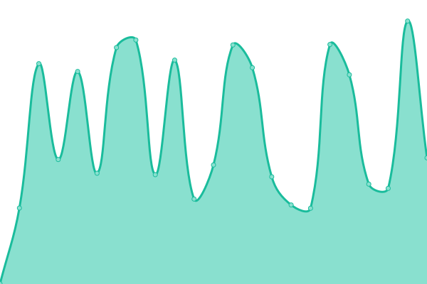
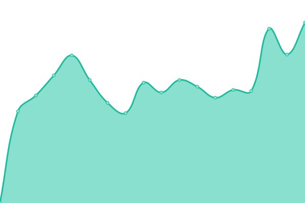
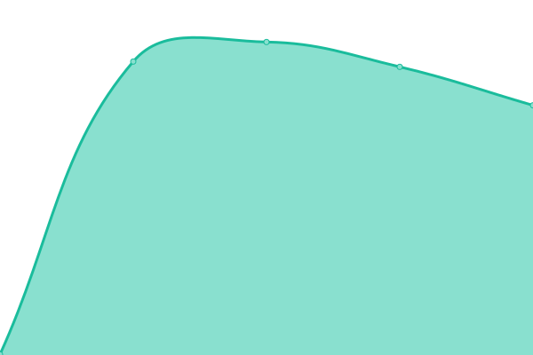
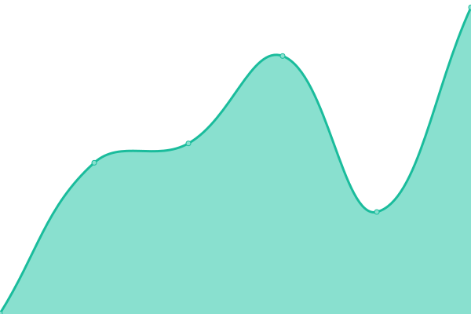

# 🟢 System Status
**Live Status Page:** [status.webbyjack.com](https://status.webbyjack.com)

This repository contains the automated uptime monitoring and incident response logging for our core infrastructure. It pings our critical endpoints every 5 minutes to ensure maximum reliability.

---

| URL | Status | History | Response Time | Uptime |
| --- | ------ | ------- | ------------- | ------ |
|  [WEBBYJACK](https://webbyjack.com) | 🟩 Up | [webbyjack.yml](https://github.com/webbyjack-dev/webbyjack-status/commits/HEAD/history/webbyjack.yml) | 

 795ms
     
 | 

<a href="https://status.webbyjack.com/history/webbyjack">99.44%</a>
    

|  [Client Portal](https://portal.webbyjack.com) | 🟩 Up | [client-portal.yml](https://github.com/webbyjack-dev/webbyjack-status/commits/HEAD/history/client-portal.yml) | 

 420ms
     
 | 

<a href="https://status.webbyjack.com/history/client-portal">98.84%</a>
    

|  [Production API](https://api.webbyjack.com) | 🟥 Down | [production-api.yml](https://github.com/webbyjack-dev/webbyjack-status/commits/HEAD/history/production-api.yml) | 

 0ms
     
 | 

<a href="https://status.webbyjack.com/history/production-api">0.00%</a>
    

|  [Dev Documentation](https://docs.webbyjack.dev) | 🟩 Up | [dev-documentation.yml](https://github.com/webbyjack-dev/webbyjack-status/commits/HEAD/history/dev-documentation.yml) | 

 328ms
     
 | 

<a href="https://status.webbyjack.com/history/dev-documentation">100.00%</a>
    

---

## 📄 Licensing & Open Source
This infrastructure dashboard is built entirely on the [Upptime](https://upptime.js.org) engine. 
- Code: [MIT](./LICENSE) © WEBBYJACK
- Data: [Open Database License](https://opendatacommons.org/licenses/odbl/1-0/)
